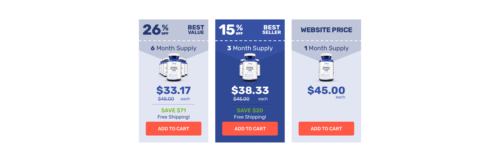

# Coding Test - Scale Media, Inc.

This is the coding test provided by Scale Media, Inc. 

The test asked to provide a mobile and desktop view of product banners for products sold by the company. 

I was tasked to implement the design and create functionality to it.

I used the following libraries to make my life easier. These libraries helped with responsiveness.

1. Bootstrap
2. jQuery

Not much of JavaScript was needed for this test. Primarily, Bootstrap helps with a brunt of the changes as does CSS Media Queries.

jQuery handles only a small portion of the Mobile view to toggle classes. of each button to collapse the product banners 

## Desktop

This was the first test I tackled. 
Create 3 banners, side by side, with functionality wherein you hover over each box and it changes the entirety of the CSS involved. You could say it inverts the color scheme when in hover mode from when it sits idle.

I was tasked to implement this design: 

This is my attempt: 

## Mobile

This was the second one. This one took more time, which shocked me, but here we are. This required me to essentially create an "accordion" of options for the product banners. Stacked on top of one another, when you click on an option, the product details opens from the bottom of the button, changing the styling of said button to match that of the product details. 

I did a hacky method of achieving this goal. I have a main container that encapsulates the button and the product details. When the button is clicked, it deletes the button class of "inactive". It works. Future iterations will be much better thought out. I will go into detail what can be changed at the end of this README.md.

This was what I needed to re-create:

This was my attempt: 

##Things that can be changed

I brute forced my way to creating these designs, however I'm very much aware of the flaws of the code. It can be imiproved upon. Here's how: 

1. Create Object Arrays
    * These designs are very much the same thing between one another. Rather than individually create each element, I could create a template and reuse that asset. After which, I can populate these templates with the Object Array data. This will make it much easier to add new banners by simply adding a new object to the array. This will change both Desktop and Mobile Views.

2. Clean up CSS
    * This is kind of a given. Again, it works, however it's just a personal problem where I believe I created one too many classes. I can definitely make this much more simple to read. For now, I'm hoping that comments will suffice enough. 

3. For loops are the future
    * That small itty bitty amount of javascript that I have can be further optimized by making a for loop rather than create a new method for each id to each element it handles.

4. 

